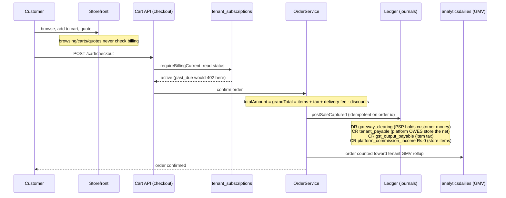
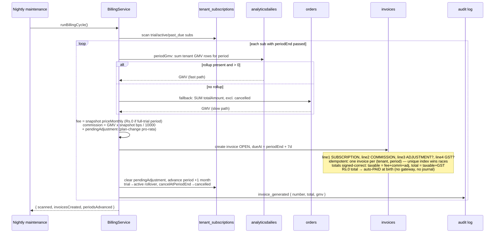
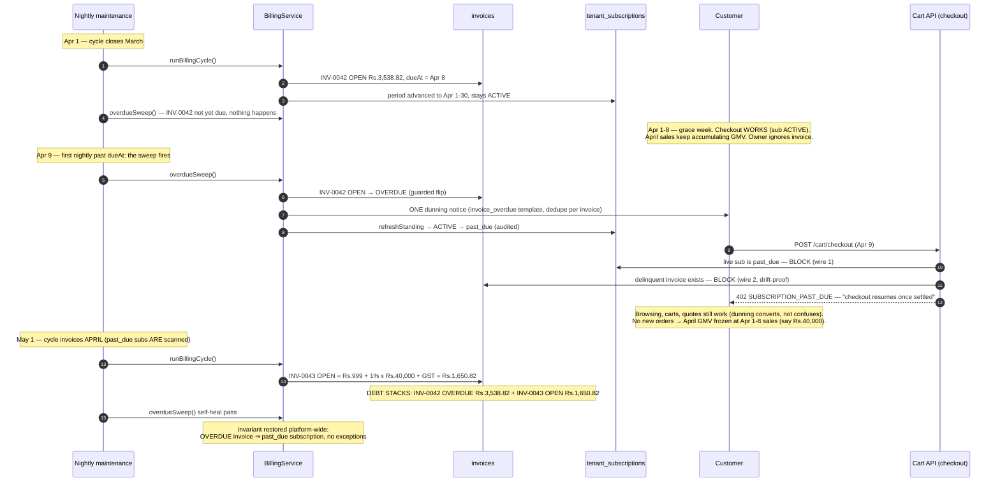

# Flowermarket billing money-flows — sequence diagrams

How plan commission (on GMV) and plan fees travel from a tenant's store
into the platform's (super admin's) account — and exactly what happens
when a tenant doesn't pay. All flows verified against
`backend/src/services/billing.service.js`, `billingProvider.service.js`,
`ledgerPosting.service.js`, `payout.service.js`,
`middleware/requireBillingCurrent.js`, and `maintenance.service.js`.

Legend: `Rs.` = rupees in diagrams (prose uses Rs). `bps` = basis points (100 bps = 1%).

---

## D1 — Order capture: sales accumulate GMV, zero per-order commission

A customer buying from the store's OWN inventory. Note what does NOT happen:
no commission is deducted here — that would double-count the monthly invoice
(verified: `ledgerPosting.service.js` header, `resolveCommissionBps()` = 0 for
non-vendor lines).



---

## D2 — Month end: the billing cycle turns GMV into an invoice

Runs every night inside the maintenance pass (`maintenance.service.js`),
or on demand via `POST /admin/billing/cycle`. Only subscriptions whose
`periodEnd` has passed are invoiced.



Snapshot rule: the invoice uses the rate/fee **frozen on the subscription**
at subscribe/change time — never the live plan catalog. A mid-period plan
change swaps the commission rate for the whole period and pro-rates only
the fee difference.

---

## D3 — Happy path: the tenant pays (sync mock vs async Razorpay)

Store owner pays from the console (`POST /store/invoices/:id/pay`, scoped so
an owner can only pay their OWN invoices); super admin can also pay on their
behalf (`POST /admin/billing/invoices/:id/pay`).

```mermaid
sequenceDiagram
    participant O as Store owner
    participant API as Billing API
    participant BS as BillingService
    participant P as BillingProvider
    participant RZ as Razorpay
    participant INV as invoices
    participant SUB as tenant_subscriptions

    O->>API: POST /store/invoices/:id/pay
    API->>BS: payInvoice(invoiceId, tenantId)
    BS->>INV: load invoice (must not be PAID/VOID)
    BS->>P: charge(invoiceId, total)
    alt mock/console provider (dev, default)
        P-->>BS: success, ref mock_inv_... (paise ending 13 = DECLINED)
        BS->>INV: status PAID, paidAt, paymentRef
        BS->>SUB: refreshStanding (block lifts at zero delinquents)
        BS-->>O: { status: paid }
    else razorpay (keys configured)
        P->>RZ: create Order (auto-capture)
        RZ-->>P: gatewayOrderId + keyId + amountPaise
        P-->>BS: pending:true (NOTHING marked paid)
        BS->>INV: park paymentRef = gatewayOrderId
        BS-->>O: { status: pending, gatewayOrderId, keyId }
        O->>RZ: completes payment in Checkout.js
        RZ->>API: webhook payment.captured + HMAC signature
        API->>BS: applyBillingWebhook(...)
        BS->>BS: verify HMAC; captured paise == invoice total?
        alt amount matches
            BS->>INV: status PAID, paymentRef = gateway payment id
            BS->>SUB: refreshStanding (block lifts at zero delinquents)
            BS-->>RZ: confirmed (ack)
        else amount mismatch
            Note over BS: invoice stays OPEN, held for operator<br/>never auto-confirms a wrong amount
            BS-->>RZ: mismatched (ack, no state change)
        end
    end
```

Money movement: tenant's card/UPI → **platform's Razorpay account**
(platform keys in `RAZORPAY_KEY_ID/SECRET`) → settles to platform bank.
That landing IS the commission + fee reaching the super admin's account.
On every confirm the platform also posts an `invoice_paid` journal
(DR gateway_clearing / CR subscription income + commission income +
`gst_output_payable:platform`), idempotent on the invoice id, with a nightly
`backfillInvoicePayments()` repairing anything the live path missed — and
`refreshStanding()` re-derives the subscription: the block lifts only when
ZERO delinquent invoices remain. Idempotency: re-paying a pending invoice
returns the SAME gateway order; webhook retries on a paid invoice ack as
`already_paid`; racing confirms collapse through one guarded status flip.

---

## D4 — THE SCENARIO: tenant does not pay (Pro store, March period)

Concrete numbers: Pro plan (Rs.999/mo, 1%, 18% GST). March GMV Rs.2,00,000 →
invoice INV-0042 = Rs.999 fee + Rs.2,000 commission + Rs.539.82 GST =
**Rs.3,538.82**. The owner ignores it. Single explicit grace: the invoice's
own `dueAt` (period end + 7d) is the deadline — the sweep flags anything past
it on the next nightly run.



### The three exits from `past_due` (all through ONE choke point)

`refreshStanding()` is the only writer of trial/active ↔ past_due: the block
lifts if and only if ZERO delinquent invoices remain.

```mermaid
sequenceDiagram
    participant O as Store owner
    participant A as Super admin
    participant BS as BillingService
    participant INV as invoices
    participant SUB as tenant_subscriptions

    alt EXIT 1 — owner pays down to zero delinquents
        O->>BS: payInvoice(INV-0042) → PAID + invoice_paid journal
        BS->>SUB: refreshStanding: 1 delinquent left → STAYS past_due
        O->>BS: payInvoice(INV-0043) → PAID + invoice_paid journal
        BS->>SUB: refreshStanding: 0 delinquents → ACTIVE, checkout resumes
    else EXIT 2 — admin voids the last delinquent invoice
        A->>BS: voidInvoice(INV-0042)
        BS->>SUB: refreshStanding: 0 delinquents → ACTIVE (void re-evaluates)
        Note over SUB: voiding one of several keeps the block —<br/>forgiveness is per-invoice, standing is global.
    else EXIT 3 — owner downgrades (allowed, block persists)
        O->>BS: changePlan(free)
        BS->>SUB: fee Rs.999 → Rs.0 + pro-rata credit queued;<br/>rate 1% → 2% PENDING (live next period, never retroactive)
        Note over SUB: future bills shrink but the old invoices are still owed;<br/>sub stays past_due until the delinquency clears.
    end
```

### What the platform NEVER does (verified absences — kept deliberately)

- **No auto-debit.** `BillingProvider.charge()` is only ever called from a
  tenant/admin-initiated `payInvoice` — there is no stored card, no mandate,
  no retry-the-card loop. The platform cannot pull; the tenant must push.
- **No late fee / interest / penalty.** The Rs.3,538.82 stays Rs.3,538.82
  forever — collection is by checkout-blocking, not by penalties.
- **No store takedown.** `Tenant.status` is untouched; the storefront stays
  browsable, carts and quotes keep working. Only `POST /cart/checkout`
  402s. Tenants with no subscription row AND no invoices fail OPEN
  (legacy/seed).
- **Metrics don't hide the debt.** `past_due` counts as a LIVE subscription
  (MRR keeps including it) and `commissionsAccrued = Σ open+paid commission
  lines`, so the super-admin dashboard shows the owed commission as accrued.

---

## D5 — Contrast: vendor items deduct commission AT SOURCE, per order

The mirror image (marketplace sellers, not store owners). Included so the two
systems are never confused.

```mermaid
sequenceDiagram
    participant OS as OrderService
    participant LG as Ledger
    participant PO as PayoutService
    participant PL as payout_line_items
    participant B as Payout batch (after return window)
    participant PP as PayoutProvider (bank)

    OS->>LG: postSaleCaptured — vendor item, net Rs.5,000, 10% rate
    Note over LG: DR gateway_clearing 5,000<br/>CR vendor_payable Rs.4,500 (net of commission)<br/>CR platform_commission_income Rs.500 (RECOGNISED NOW)<br/>CR gst_output_payable (seller GST)
    OS->>PO: accrueForOrder
    PO->>PL: freeze line: commission 500 + GST-on-commission 90 + TCS + TDS
    Note over PL: payable only after the return window closes
    B->>PL: collect matured lines → batch (net payable)
    B->>PP: pay vendor net to bank account
    PP-->>B: settled; vendor_payable drained, platform keeps commission + GST cut
```

Rule of thumb: **vendors are deducted per order because the platform pays
them; tenants are invoiced monthly because the platform bills them.**
Store-owned items accrue no per-order commission (D1) precisely so D2 never
double-counts — the asymmetry is deliberate and documented in
`ledgerPosting.service.js`.
