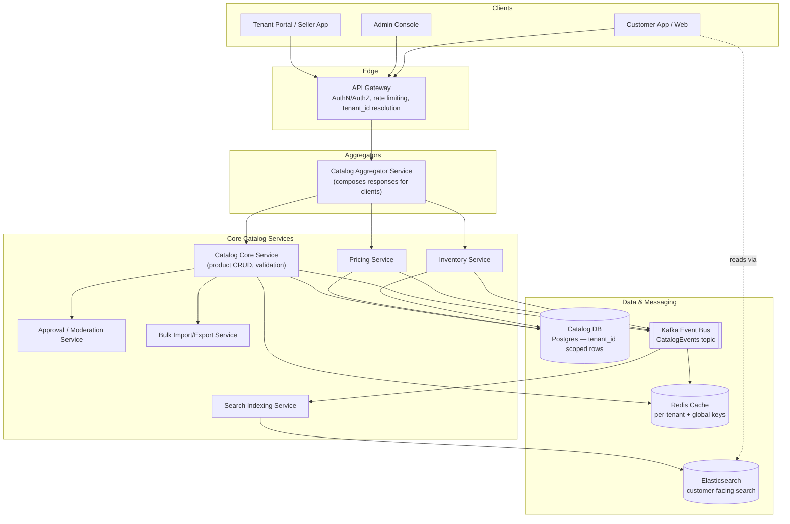
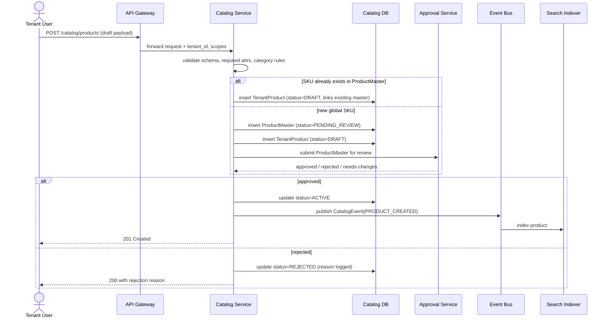
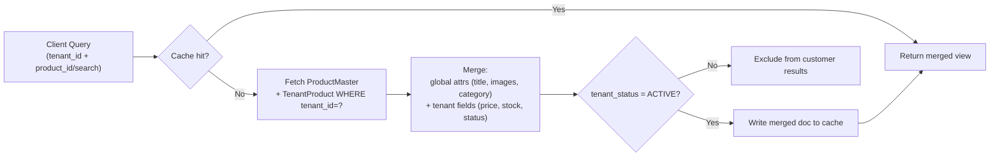
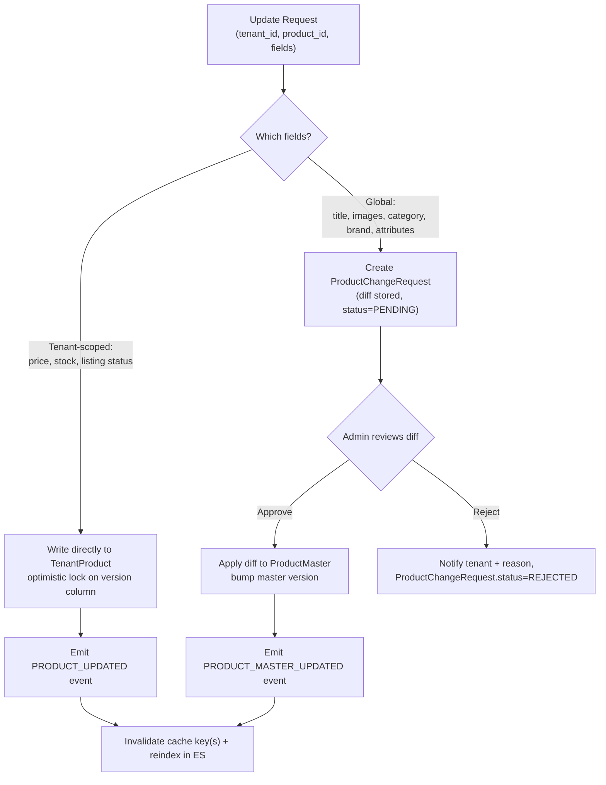
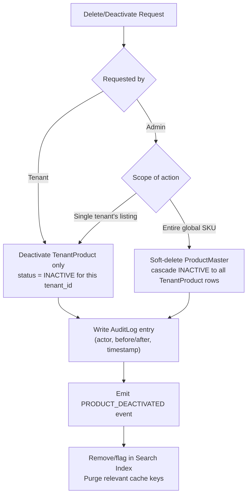
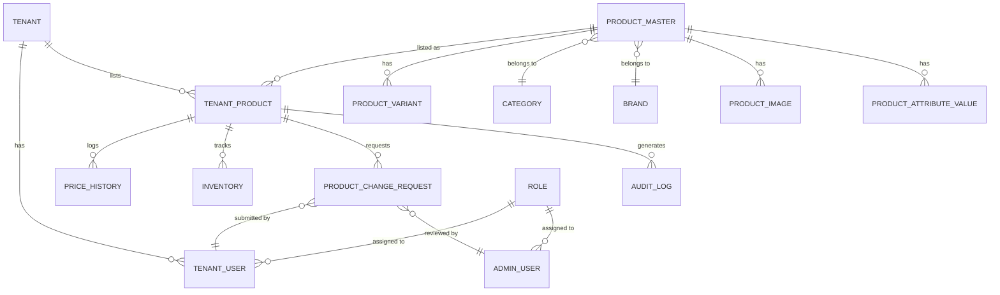

# Multi-Tenant Catalog Management System — Architecture Reference
### (Illustrative design, in the style of a large grocery/quick-commerce platform such as BigBasket)

> **Note on scope:** BigBasket has not published the internals of its actual catalog database or CRUD pipeline — that's proprietary. What follows is a realistic, production-grade design for a multi-tenant grocery catalog, built on patterns their public engineering blog confirms they use (API-gateway → aggregator → core microservices), and on standard practice for platforms where a central catalog is shared across many local operating units. Use this as a system-design reference, not a description of BigBasket's actual codebase.

---

## 1. Who are the "tenants"?

In a grocery/quick-commerce platform, "multi-tenant" usually doesn't mean independent unrelated companies sharing infra — it means **multiple operating units sharing one global product catalog, each with its own local overrides**:

| Tenant type | Owns | Does NOT own |
|---|---|---|
| **City / Dark-store cluster** | Local price, stock, availability, delivery slot mapping | Product title, images, brand, category taxonomy |
| **Franchise partner** | Local price (within admin-set bounds), stock | Global product identity, compliance attributes |
| **Marketplace seller** | Their own SKU listing, price, stock, seller-specific images | Global category taxonomy, brand registry |
| **Central Admin / Catalog Ops** | Everything global: taxonomy, brand master, product identity, approval workflow, compliance | — |

This "shared global master + tenant-scoped overrides" model is why almost every field in the CRUD flows below branches into **"tenant-scoped write"** vs **"global write requiring admin approval."**

---

## 2. High-Level System Architecture

**Key ideas baked into this diagram:**
- The **API Gateway** resolves `tenant_id` from the auth token on every request — nothing downstream trusts a client-supplied tenant ID.
- An **Aggregator** sits in front of core services so client apps make one call, not five (matches BigBasket's own publicly described aggregator pattern).
- Every write goes through **Catalog Core Service → Postgres**, then **emits an event** — nothing else (cache, search, downstream systems) is updated synchronously. This keeps writes fast and consistency eventual-but-reliable.

---

## 3. CRUD Flow #1 — Create Product

**Deeper detail:** tenants can *never* create a `ProductMaster` directly if the SKU is genuinely new — it always routes through `ApprovalService`, which checks brand registry, category taxonomy, duplicate-SKU detection (fuzzy match on title + barcode/EAN), and compliance flags (FSSAI license for food items, etc.). Only the **tenant-specific listing** (price/stock/status) is writable without review.

---

## 4. CRUD Flow #2 — Read / Query (merged view)

This is the pattern that makes multi-tenancy invisible to the customer: a product only shows up for a customer in City A if `TenantProduct(tenant=A, product=X).status = ACTIVE`, even though the same `ProductMaster` row is shared with 50 other cities.

---

## 5. CRUD Flow #3 — Update (the field-ownership branch)

**Why the branch matters:** if any tenant could edit `title` or `images` directly, 50 dark stores could silently fork the same SKU into 50 different products — search relevance, brand compliance, and customer trust all break. Splitting the write path at the field level is the core trick that makes shared-catalog multi-tenancy work at all.

---

## 6. CRUD Flow #4 — Delete / Deactivate

Hard deletes are avoided entirely — everything is a soft `status` transition, both for order-history integrity (a customer's past order still needs to render the product) and for auditability.

---

## 7. Database Models

### Entity-Relationship Overview

### Model Field Reference

| Model | Key fields | Notes |
|---|---|---|
| **Tenant** | `id`, `type` (city/franchise/seller), `name`, `region`, `status`, `parent_tenant_id` | `parent_tenant_id` allows hierarchical tenants (e.g. franchise under a city) |
| **TenantUser** | `id`, `tenant_id`, `role_id`, `email`, `status` | Scoped strictly to one `tenant_id` |
| **AdminUser** | `id`, `role_id`, `email`, `department` | Not tenant-scoped; global access per role |
| **Role** | `id`, `name`, `permissions[]` (JSON/array of scoped actions) | RBAC — see action matrix below |
| **Category** | `id`, `parent_category_id`, `name`, `attribute_schema` (JSON schema of required attrs) | Tree structure; `attribute_schema` drives form validation on create |
| **Brand** | `id`, `name`, `is_verified`, `compliance_docs` | Verified brands skip some approval steps |
| **ProductMaster** | `id`, `sku_global`, `title`, `description`, `category_id`, `brand_id`, `barcode`, `status` (PENDING_REVIEW/ACTIVE/REJECTED/DEPRECATED), `version`, `created_by` | The single source of truth for "what this product is" |
| **ProductVariant** | `id`, `product_id`, `variant_type` (weight/pack-size/flavor), `variant_value` | e.g. 500g vs 1kg of the same SKU family |
| **ProductImage** | `id`, `product_id`, `url`, `is_primary`, `uploaded_by` | Tenant-uploaded images route through `ProductChangeRequest` too |
| **ProductAttributeValue** | `id`, `product_id`, `attribute_key`, `value` | EAV-style table for category-specific attributes (e.g. "shelf life", "FSSAI code") |
| **TenantProduct** | `id`, `tenant_id`, `product_id`, `price`, `mrp`, `stock_qty`, `status` (DRAFT/ACTIVE/INACTIVE/OUT_OF_STOCK), `version` | The row that actually makes a product *sellable* in a given tenant |
| **PriceHistory** | `id`, `tenant_product_id`, `old_price`, `new_price`, `changed_by`, `changed_at` | Append-only, for pricing audits & analytics |
| **Inventory** | `id`, `tenant_product_id`, `warehouse_id`, `qty_available`, `qty_reserved`, `updated_at` | Can be its own microservice/DB in practice; shown here for completeness |
| **ProductChangeRequest** | `id`, `tenant_product_id`, `requested_by`, `diff` (JSON), `status` (PENDING/APPROVED/REJECTED), `reviewed_by`, `reviewed_at` | Every global-field edit from a tenant lands here first |
| **AuditLog** | `id`, `entity_type`, `entity_id`, `actor_id`, `actor_type` (tenant/admin), `action`, `before`, `after`, `timestamp` | Immutable; feeds compliance & rollback tooling |
| **CatalogEvent** (Kafka payload, not a DB table) | `event_type`, `entity_id`, `tenant_id`, `payload`, `emitted_at` | Drives cache invalidation, search reindexing, downstream sync |

---

## 8. Tenant vs Admin — Action Matrix

| CRUD Op | Tenant can do | Admin can do |
|---|---|---|
| **Create** | Create `TenantProduct` for an existing `ProductMaster`; propose a *new* `ProductMaster` (goes to review) | Directly create `ProductMaster` (skips review); bulk-import via `BulkService`; define new `Category`/`Brand` |
| **Read** | Read own tenant's merged catalog view; read global taxonomy (read-only) | Read any tenant's catalog; read full audit trail; read pending `ProductChangeRequest` queue |
| **Update — tenant-scoped fields** (price, stock, listing status) | Direct write | Direct write (any tenant, with audit log noting admin override) |
| **Update — global fields** (title, images, category, brand, attributes) | Submit `ProductChangeRequest` only | Approve/reject requests; direct-edit `ProductMaster` |
| **Delete/Deactivate — own listing** | Deactivate own `TenantProduct` | Deactivate any tenant's `TenantProduct` |
| **Delete/Deactivate — global SKU** | Not permitted | Soft-delete `ProductMaster`, cascades to all tenants |
| **Approve/Reject workflow** | Not permitted | Full access — this is admin's core catalog-ops job |
| **Taxonomy management** (categories, attribute schemas, brand registry) | Not permitted | Full access |
| **Bulk operations** (CSV/Excel import-export) | Bulk-upload own tenant's price/stock only | Bulk-upload global product data + tenant listings across any tenant |
| **View audit logs** | Own tenant's actions only | All tenants, all actors |

---

## 9. Deeper Considerations

- **Isolation strategy:** shared schema with `tenant_id` on every tenant-scoped table (not schema-per-tenant) — appropriate here because tenants share 90%+ of catalog data (the `ProductMaster`); schema-per-tenant would force expensive cross-schema joins just to render one product page. Row-level security policies in Postgres enforce `tenant_id` isolation as a second line of defense beneath the application layer.
- **Concurrency control:** `version` column + optimistic locking on both `ProductMaster` and `TenantProduct` — two admins editing the same SKU, or a tenant updating stock while an admin approves a change request, must not silently overwrite each other.
- **Eventual consistency, by design:** cache and search index are never updated synchronously with the write — the event bus decouples them so a catalog write stays fast (~tens of ms) even though reindexing might take seconds. Clients that need read-your-own-write consistency (e.g. the tenant portal right after a save) read from the primary DB, not the cache, for a short TTL window.
- **Bulk operations:** large tenants don't call the CRUD API row-by-row — they upload CSV/Excel, which `BulkService` parses into a batch of the same `ProductChangeRequest`/`TenantProduct` writes, processed async with a job-status endpoint for polling.
- **Compliance gating:** categories like food/pharma attach a `attribute_schema` requiring fields like FSSAI license or expiry-date tracking — the create/update validation step rejects submissions missing these before they ever reach approval.
- **Rate limiting per tenant:** enforced at the API Gateway so one high-volume tenant's bulk job can't starve other tenants' interactive traffic.
