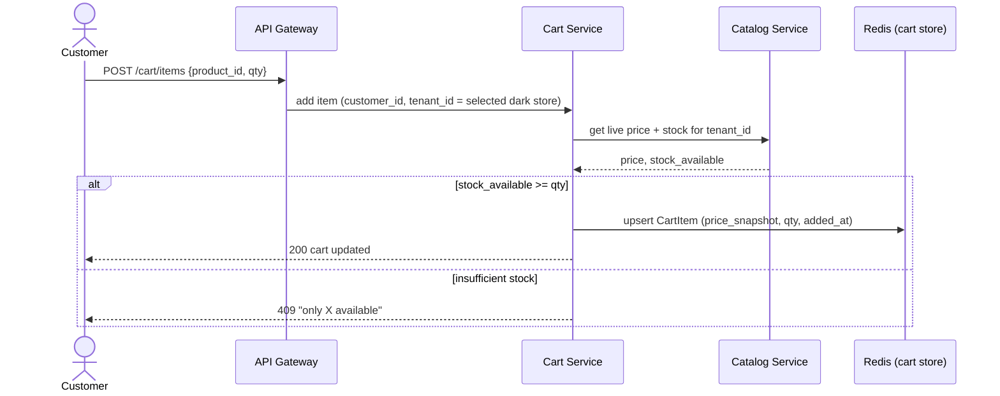
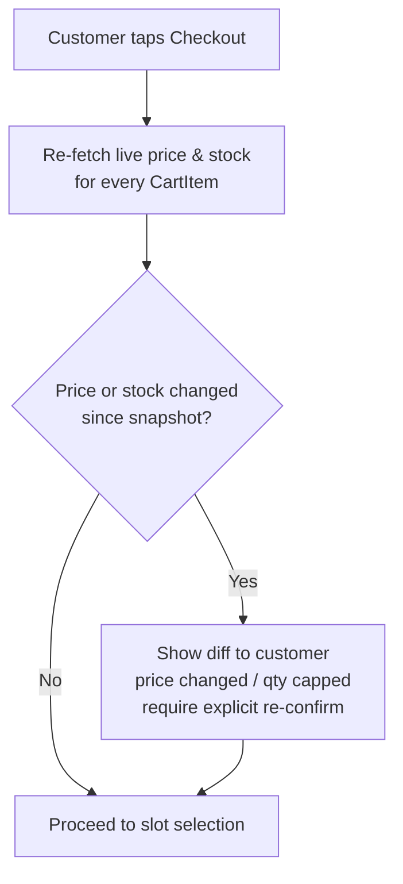
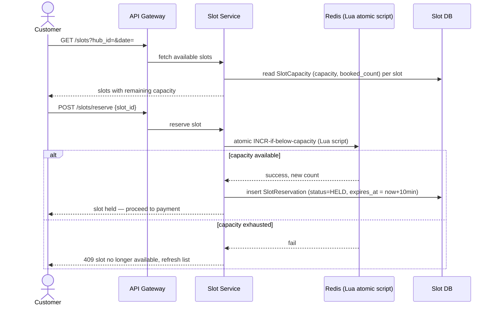
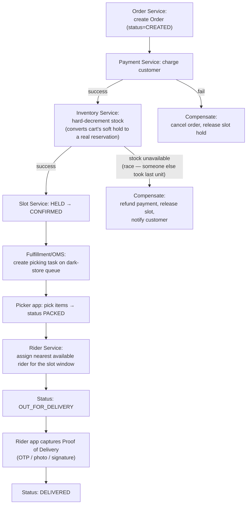
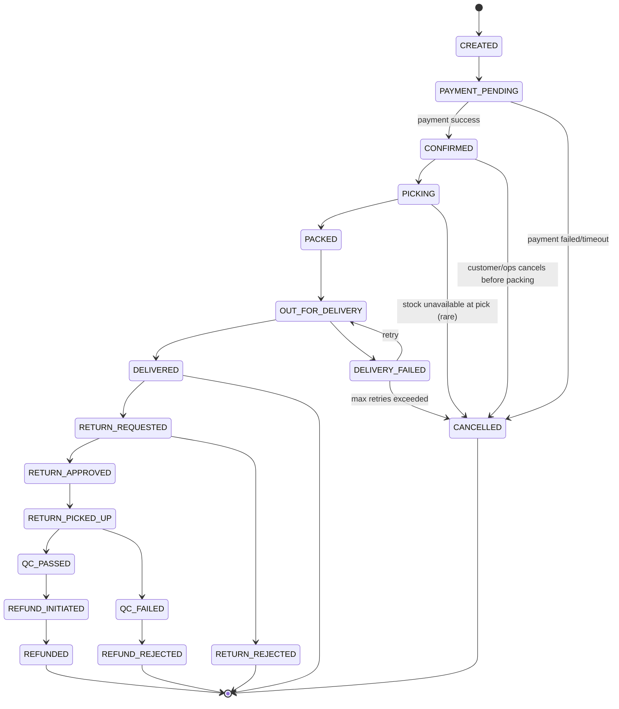
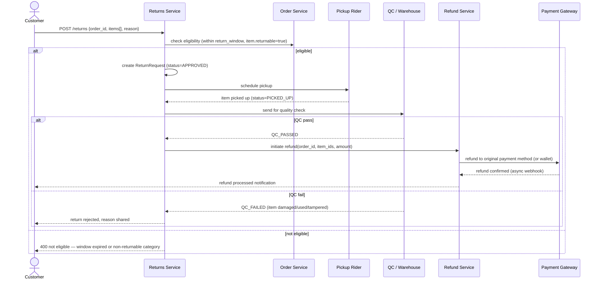
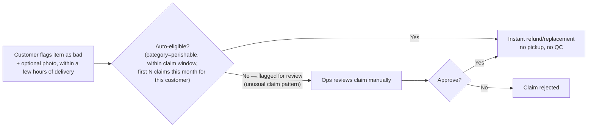
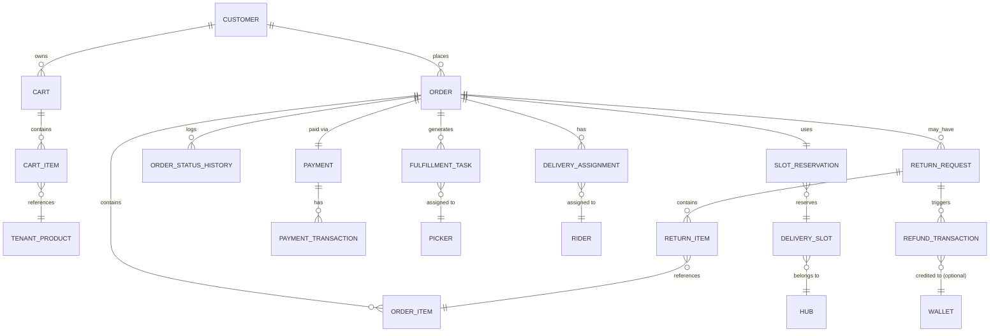

# Cart → Slotted Delivery → Fulfillment → Returns/Refunds — Architecture Reference
### (Continuation of the multi-tenant catalog design; same illustrative approach)

> Same caveat as before: this is a realistic, production-grade design for how a quick-commerce/grocery platform's order lifecycle *would* work, not a description of any specific company's actual codebase.

---

## 1. Why this part of the system is fundamentally different from catalog

Catalog CRUD is mostly about **field ownership** (who can edit what). Order lifecycle is about **coordinating a single business transaction across five independent services** — Cart, Inventory, Payment, Slot/Delivery, Fulfillment — where any one of them can fail *after* the others have already succeeded. A payment can succeed while stock silently ran out seconds earlier. A slot can be double-booked under concurrent load. This is why almost every flow below is built around **atomic locking** and **compensating transactions (saga pattern)**, not simple request/response.

---

## 2. Cart

Cart is deliberately **not** treated like a durable business record — it's a fast, disposable, frequently-mutated draft. Two design choices follow from that:
- Stored in **Redis** (keyed by `customer_id` + `tenant_id`) for speed, not Postgres — with a periodic snapshot to DB so an abandoned cart survives a Redis restart.
- Every price/stock value in the cart is a **snapshot at add-time**, re-validated only at checkout — not kept live-synced, since re-syncing on every catalog price change across millions of carts would be wasteful.

### Checkout-time revalidation — the stale-cart problem

A cart can sit for hours; by checkout, price or stock may have moved. This is re-checked explicitly, once, right before slot selection:

This single revalidation step is what prevents "I ordered at ₹40, got charged ₹45" complaints — the customer always re-confirms before payment, never after.

---

## 3. Slotted Delivery — the concurrency-critical piece

Delivery slots have **hard capacity** (a hub can only pack/dispatch N orders in a given 30-minute window). Under real traffic, many customers hit "book the 6–6:30 PM slot" within the same second — this is a classic **overselling** race condition, solved with an atomic counter, not a simple `SELECT` then `UPDATE`.

**Why Redis + Lua, not a DB row lock:** a plain `UPDATE ... WHERE booked_count < capacity` works too, but at hub-level concurrency (hundreds of reservation attempts/sec during peak hours across thousands of hubs) an in-memory atomic script avoids DB connection contention. The `SlotReservation` row in Postgres is the durable record; Redis is just the fast gatekeeper.

**The HELD state matters:** a slot is reserved the moment checkout starts, *before* payment — otherwise two customers could both reach the payment page for the last slot. If payment fails or the customer abandons checkout, a background TTL sweep releases the hold (decrements the Redis counter, marks the reservation `EXPIRED`) after 10 minutes.

---

## 4. Order Fulfillment — the saga

This is where cart, slot, payment, inventory, and delivery all get stitched into one order. It's modeled as a **saga**: a sequence of steps, each with a defined compensating action if a later step fails.

**Why "hard-decrement after payment," not before:** if inventory were decremented at cart-add time, a customer who adds an item and never checks out would block stock from everyone else. So cart/checkout only does a **soft, short-TTL reservation check** ("is there enough right now?"); the **real, durable decrement** happens only once payment has actually succeeded — that's also the point where a genuine race (two orders confirmed near-simultaneously against the last unit) is checked again and, if lost, triggers the refund-compensation branch above.

### Order status as a state machine

Every transition here writes an `OrderStatusHistory` row — this is what powers the customer-facing "track your order" timeline, and it's also the audit trail ops uses to debug "why is my order stuck."

---

## 5. Returns & Refunds

Two genuinely different flows exist here, and conflating them is a common design mistake:

**A. Standard return** (electronics, packaged goods, non-perishables) — physical pickup + quality check before refund:

**B. Perishables / fresh produce ("quality guarantee")** — no pickup at all; refund is claim-based, since asking a customer to return a rotten tomato is pointless:

The `AutoCheck` fraud-guard (rate-limiting how many "the item was bad" claims one customer can make per month) matters — a claim-based, no-proof-required refund path is an obvious abuse vector without it.

---

## 6. Database Models

| Model | Key fields | Notes |
|---|---|---|
| **Cart** | `id`, `customer_id`, `tenant_id`, `created_at`, `expires_at` | Redis-primary, Postgres snapshot for recovery |
| **CartItem** | `cart_id`, `tenant_product_id`, `qty`, `price_snapshot`, `added_at` | `price_snapshot` re-validated at checkout, never trusted |
| **Hub** | `id`, `name`, `geofence`, `region_id` | The dark store / fulfillment center |
| **DeliverySlot** | `id`, `hub_id`, `date`, `start_time`, `end_time`, `capacity` | Capacity set by ops based on historical picker/rider throughput |
| **SlotReservation** | `id`, `slot_id`, `order_id` (nullable until confirmed), `status` (HELD/CONFIRMED/EXPIRED/RELEASED), `expires_at` | The row Redis's atomic counter is protecting |
| **Order** | `id`, `customer_id`, `tenant_id`, `status`, `total_amount`, `slot_reservation_id`, `created_at`, `version` | `version` for optimistic locking during saga steps |
| **OrderItem** | `order_id`, `tenant_product_id`, `qty`, `price_at_order`, `sku_snapshot` (title/image at time of order, for history even if catalog changes later) | |
| **OrderStatusHistory** | `id`, `order_id`, `from_status`, `to_status`, `actor`, `timestamp` | Powers the "track order" timeline |
| **Payment** | `id`, `order_id`, `amount`, `status`, `idempotency_key` | `idempotency_key` prevents double-charging on client retries |
| **PaymentTransaction** | `id`, `payment_id`, `gateway_ref`, `type` (CHARGE/REFUND), `status`, `raw_gateway_response` | One `Payment` can have multiple transactions (charge + later refund) |
| **FulfillmentTask** | `id`, `order_id`, `hub_id`, `picker_id`, `status` (QUEUED/PICKING/PACKED), `picked_at` | |
| **Picker** | `id`, `hub_id`, `status` (AVAILABLE/BUSY) | |
| **DeliveryAssignment** | `id`, `order_id`, `rider_id`, `status`, `assigned_at`, `pod_type`, `pod_reference` | `pod_reference` = OTP hash / photo URL / signature |
| **Rider** | `id`, `hub_id`, `status`, `current_location` | |
| **ReturnRequest** | `id`, `order_id`, `reason`, `status`, `claim_type` (PICKUP_QC / INSTANT_CLAIM), `created_at` | `claim_type` branches to flow A or B above |
| **ReturnItem** | `return_request_id`, `order_item_id`, `qty`, `qc_status` | |
| **RefundTransaction** | `id`, `return_request_id`, `amount`, `destination` (ORIGINAL_METHOD/WALLET), `status`, `initiated_at`, `completed_at` | |
| **Wallet** | `id`, `customer_id`, `balance` | Faster refund path than gateway round-trip; also used for goodwill credits |

---

## 7. Action Matrix

| Stage | Customer | Picker | Rider | Ops/Admin | System (automated) |
|---|---|---|---|---|---|
| **Cart** | Add/remove/update items | — | — | View for support debugging | Revalidate price/stock at checkout |
| **Slot** | Select & hold a slot | — | — | Set slot capacity per hub | Atomic reserve, TTL-expire unpaid holds |
| **Payment** | Pay | — | — | Manual refund override for edge cases | Charge, webhook reconciliation |
| **Fulfillment** | Track status | Pick & pack items | — | Reassign task if picker unavailable | Auto-create picking task on order confirm |
| **Delivery** | Track rider, confirm receipt (OTP) | — | Accept assignment, capture POD | Reassign on rider no-show | Auto-assign nearest available rider |
| **Cancellation** | Cancel before packing starts | — | — | Force-cancel any order (with reason) | Release slot + inventory + trigger refund |
| **Returns** | Submit request / instant claim | — | Pickup (standard flow only) | Approve/reject edge-case claims | Auto-approve claims within policy bounds |
| **Refund** | View refund status | — | — | Manual override refund destination | Auto-initiate on QC pass / instant claim |

---

## 8. Deeper Considerations

- **Saga orchestration, not choreography:** with this many services (payment, inventory, slot, delivery), an explicit **Order Orchestrator** owning the saga's state machine is far easier to debug than a fully event-driven choreography where "who's responsible for the next step" is implicit. Choreography (pure event chains) is used *within* a stage (e.g., fulfillment events triggering search/cache updates), but the cross-service order saga itself is centrally orchestrated.
- **Idempotency everywhere money moves:** every payment charge and every refund call carries an `idempotency_key`. Clients (app, retry logic, even the orchestrator itself after a crash) can safely resend the same request without double-charging or double-refunding — the payment gateway and internal `Payment`/`RefundTransaction` tables both dedupe on this key.
- **Two-phase inventory commitment:** cart/checkout does a *soft* stock check (read-only, no lock); only post-payment does a *hard* decrement. This is a deliberate tradeoff — it allows massive concurrent browsing/cart activity without lock contention, at the cost of a small chance the hard-decrement step loses a race and has to trigger the refund-compensation branch. That tradeoff is almost always better than locking inventory rows on every cart add.
- **Webhook reconciliation job:** payment gateways deliver refund/charge confirmations via async webhook, which can be delayed, dropped, or arrive out of order. A periodic reconciliation job polls the gateway for any `Payment`/`RefundTransaction` stuck in a pending state past a threshold, rather than trusting webhooks as the only source of truth.
- **Slot capacity is a forecasting problem, not just a locking one:** the locking mechanism (Redis atomic counter) prevents *overselling* a slot, but the `capacity` number itself comes from a separate forecasting process (historical picker/rider throughput per hub, adjusted for weather/demand spikes) — get that number wrong and the locking is protecting the wrong limit.
- **Cancellation is the saga running in reverse:** cancelling a `CONFIRMED` order isn't a single status flip — it must release the slot hold, reverse the inventory decrement, and trigger a refund, in that order, with each step itself retried/compensated if it fails. It's implemented as the same orchestrator, just walking backward through the saga steps already completed.
- **Refund destination logic:** small refunds / low-trust-risk cases route to `Wallet` by default (instant, no gateway round-trip, encourages repeat use); larger amounts or customer-requested "back to card" route through the gateway, which is slower (T+2 to T+7 days depending on bank) — this distinction is usually surfaced to the customer at refund-initiation time so expectations are set correctly.
