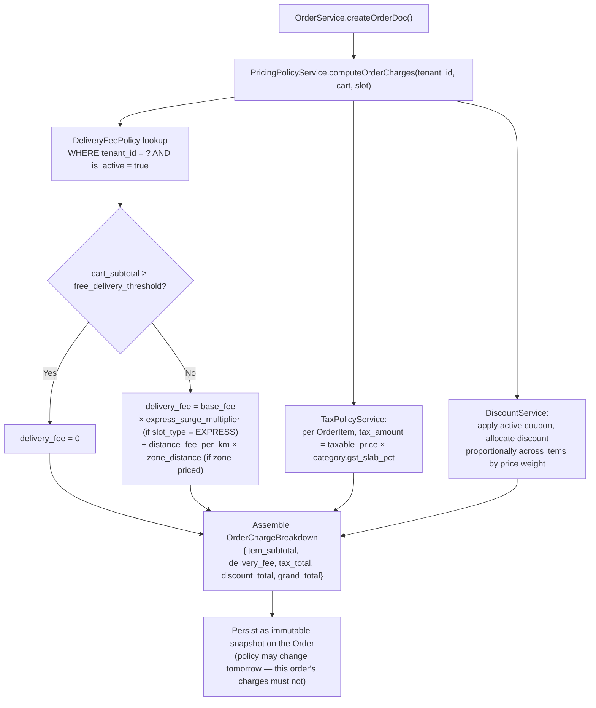
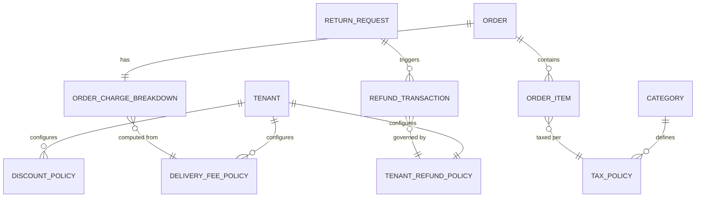
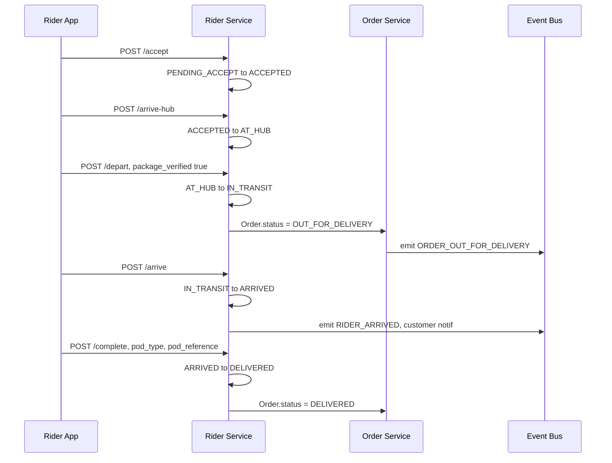
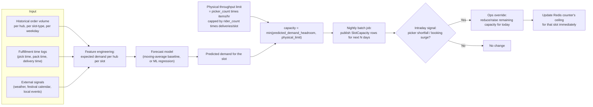
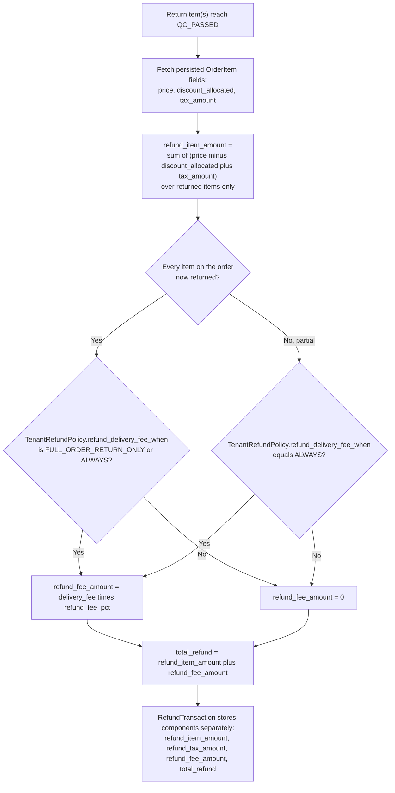

# Per-Tenant Charges, Rider Endpoints, Slot Forecasting & Refund Fee Handling
### (Continuation — same illustrative approach as the prior two documents)

---

## 1. The root problem behind the hardcoded `49`

`deliveryFee = 49` in `createOrderDoc` isn't really "a missing config value" — it's a symptom of a bigger gap: **the order isn't persisting a cost breakdown at all**, just a single number bolted on. That's also *exactly* why returns "refund item-only amounts, not the fee share" — there's nowhere on the order to even ask "what was the fee, was tax charged per item, was a discount applied to this specific item?" Fix the breakdown once, and both problems disappear at the same time. So this section and the last section are really one fix, not two.

---

## 2. Per-Tenant Delivery Fee / Tax / Discount Policy Engine

### Computation flow (replacing the hardcoded value)



**Why the breakdown must be persisted, not recomputed on read:** if `DeliveryFeePolicy` for a tenant changes next week (say, the free-delivery threshold goes from ₹199 to ₹249), every historical order's displayed charges — and any future refund calculation against it — must still reflect what the customer was *actually charged*, not today's policy. This is the same "snapshot vs. live" principle used for cart price snapshots earlier.

### Suggested refactor shape

```typescript
// Before:
const deliveryFee = 49; // hardcoded in createOrderDoc

// After:
const charges = await pricingPolicyService.computeOrderCharges({
  tenantId,
  cartSubtotal: cart.subtotal,
  slotType: selectedSlot.type,        // STANDARD | EXPRESS
  zoneDistanceKm: hub.distanceTo(deliveryAddress),
  appliedCouponCode: cart.couponCode,
});
// charges = { itemSubtotal, deliveryFee, taxTotal, discountTotal, grandTotal, lineItems[] }

order.chargeBreakdownId = await persistChargeBreakdown(order.id, charges);
```

### New/updated database models



| Model | Key fields | Notes |
|---|---|---|
| **DeliveryFeePolicy** | `id`, `tenant_id`, `base_fee`, `free_delivery_threshold`, `express_surge_multiplier`, `distance_fee_per_km`, `effective_from/to`, `is_active` | One tenant can have multiple rows over time; only one `is_active` at a given moment |
| **TaxPolicy** | `id`, `category_id`, `gst_slab_pct`, `hsn_code`, `effective_from/to` | Category-level, not tenant-level — GST is a legal classification, not a business choice |
| **DiscountPolicy** | `id`, `tenant_id` (nullable = platform-wide), `code`, `discount_type` (FLAT/PERCENT), `value`, `min_cart_value`, `max_discount_cap`, `usage_limit_per_customer`, `valid_from/to` | |
| **OrderChargeBreakdown** | `id`, `order_id`, `item_subtotal`, `delivery_fee`, `tax_total`, `discount_total`, `grand_total`, `delivery_fee_policy_id` (audit ref) | Immutable once written |
| **OrderItem** *(extended)* | `price`, `tax_amount`, `discount_allocated`, `line_total` | The two new fields (`tax_amount`, `discount_allocated`) are what makes correct per-item refunds possible later — computed once, at order time, never recalculated |
| **TenantRefundPolicy** | `id`, `tenant_id`, `refund_delivery_fee_when` (NEVER / FULL_ORDER_RETURN_ONLY / ALWAYS), `refund_fee_pct` | Covered in detail in §5 |

---

## 3. Rider App Endpoints

The delivery leg of fulfillment needs its own small API surface, tied directly to `DeliveryAssignment.status` transitions:

| Endpoint | Precondition | New status | Side effects |
|---|---|---|---|
| `POST /rider/deliveries/{id}/accept` | `status=PENDING_ACCEPT`, `rider.status=AVAILABLE` | `ACCEPTED` | `rider.status → BUSY`; cancels reassignment timer |
| `POST /rider/deliveries/{id}/reject` | `status=PENDING_ACCEPT` | stays `PENDING_ACCEPT` | reassign to next-nearest rider; this rider excluded from retry pool for this order |
| `POST /rider/deliveries/{id}/arrive-hub` | `status=ACCEPTED` | `AT_HUB` | prompts picker handoff confirmation (barcode/order-ID scan match) |
| `POST /rider/deliveries/{id}/depart` | `status=AT_HUB`, body: `{package_verified: true}` | `IN_TRANSIT` | `Order.status → OUT_FOR_DELIVERY`; customer notified with live tracking link |
| `POST /rider/deliveries/{id}/arrive` | `status=IN_TRANSIT` | `ARRIVED` | customer notified "rider is outside" |
| `POST /rider/deliveries/{id}/complete` | `status=ARRIVED`, body: `{pod_type, pod_reference}` | `DELIVERED` | `Order.status → DELIVERED`; triggers invoice/rating prompt |
| `POST /rider/deliveries/{id}/fail` | `status=ARRIVED` or `IN_TRANSIT`, body: `{fail_reason}` | `FAILED` | triggers retry-or-reschedule step in the fulfillment saga |



**Two details worth being deliberate about:**
- `package_verified` on `/depart` exists specifically to stop a rider leaving the hub with the wrong or an incomplete order — it's a cheap, high-value gate.
- `/accept` needs a **timeout**, not just a state field — if a rider doesn't respond within, say, 30–45 seconds, the assignment should auto-reassign to the next-nearest rider rather than sit `PENDING_ACCEPT` waiting for a human to notice a stuck order.

---

## 4. Slot Forecasting

Earlier, the Redis atomic counter *protects* `SlotCapacity.capacity` from overselling — but it doesn't decide what that number should be. That's a separate forecasting concern, and getting it wrong (setting capacity too high) makes the locking mechanism useless: it'll happily oversell exactly up to a limit that was never achievable in the first place.



**The key relationship to hold onto:** forecasting sets the *number*; the Redis atomic-INCR mechanism from the earlier document *enforces* that number under concurrency. They're two different concerns that are easy to conflate — one is a prediction problem, the other is a distributed-systems correctness problem.

**Closing the loop:** every completed order feeds *actual* pick/pack/delivery time back into `Fulfillment time logs` — if a hub consistently blows past its promised delivery window, that's a signal the model was over-optimistic about `physical_limit`, and next day's forecast should self-correct downward, not just repeat the same mistake.

---

## 5. Delivery Fee (and Tax, and Discount) in Returns/Refunds — the flagged gap

### What "item-only refund" actually breaks

With only `OrderItem.price` stored and a flat `deliveryFee` on the order, a refund built by summing returned item prices silently gets **three things wrong**, not one:

1. **Delivery fee** — never refunded even when policy says it should be (e.g., customer returns their entire order).
2. **Tax** — if tax was charged per item but only tracked as one lump `tax_total` on the order, there's no way to know how much tax to reverse for *just the returned items*.
3. **Discount** — if a coupon discounted the whole cart, returning one item should reverse only *that item's share* of the discount, not the full item price at face value.

All three are fixed by the same move: **persist per-item breakdowns at order time** (§2's `OrderItem.tax_amount` and `discount_allocated`), so refund calculation is a lookup, not a recomputation against possibly-changed policy.

### Corrected refund calculation



### Why the fee decision has to be an explicit policy, not a silent default

Whether a full-order return should also refund the delivery fee is a genuine business call, not an engineering one — the delivery *did* physically happen. Some platforms keep the fee always (service was rendered); some refund it on full returns only (goodwill/fairness); some never charge separately at all. Hardcoding either behavior is exactly the same class of mistake as hardcoding `49` — it belongs in `TenantRefundPolicy`, configurable per tenant, with `refund_fee_pct` even allowing a partial split (e.g., refund 50% of the fee on a full return as a middle ground).

### Why components must be stored separately, not just a single `total_refund`

Beyond correctness, this matters for **finance/compliance**: a GST credit note for a return legally needs to show the tax being reversed as its own line, not folded into a generic refund total. Storing `refund_item_amount`, `refund_tax_amount`, and `refund_fee_amount` as distinct fields on `RefundTransaction` isn't over-engineering — it's what the accounting/reconciliation side of the business will need the moment this scales past a handful of manual refunds.

### Suggested refactor shape

```typescript
// Before: refund = sum of returned item prices, delivery fee untouched

// After:
const refund = await refundCalculator.compute({
  orderId,
  returnedOrderItemIds,   // items that passed QC
});
// refund = {
//   refundItemAmount,   // sum of (price - discount_allocated + tax_amount) for returned items
//   refundTaxAmount,    // broken out separately for credit-note purposes
//   refundFeeAmount,    // 0 unless TenantRefundPolicy triggers it
//   totalRefund
// }

await refundTransactionRepo.create({ returnRequestId, ...refund });
```

---

## 6. How these four pieces connect

- The **policy engine** (§2) is what stops `49` from being hardcoded, by persisting a real breakdown at order time.
- That persisted breakdown is the **only thing** that makes the returns fix (§5) possible — without per-item `tax_amount`/`discount_allocated`, there's nothing correct to refund against.
- The **rider endpoints** (§3) are orthogonal to charges but share the same underlying discipline: every state transition is explicit and preconditioned, not inferred — the same principle that makes the charge breakdown reliable (nothing recomputed implicitly, everything persisted at the moment it's true).
- **Slot forecasting** (§4) is the one piece not directly about money — but it's what determines whether the `EXPRESS` slot surge multiplier in §2's fee calculation is even honest: if a hub is forecast-undercapacity and still lets customers book (and pay a surge fee for) an express slot it can't hit, that's a policy-and-forecasting gap, not a locking gap.
